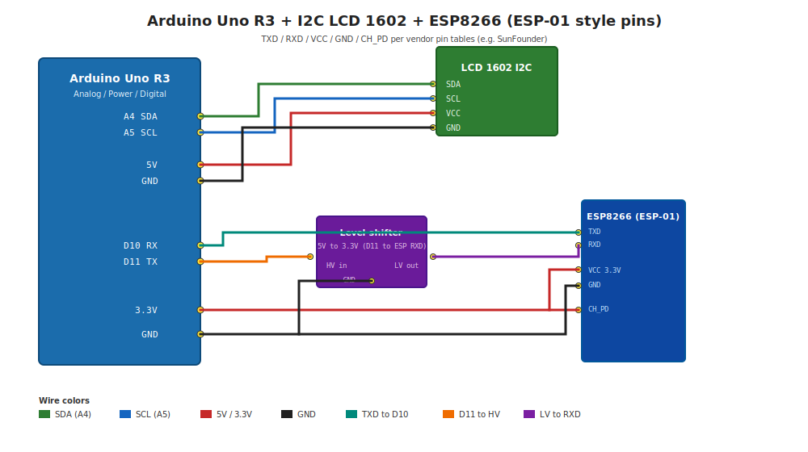
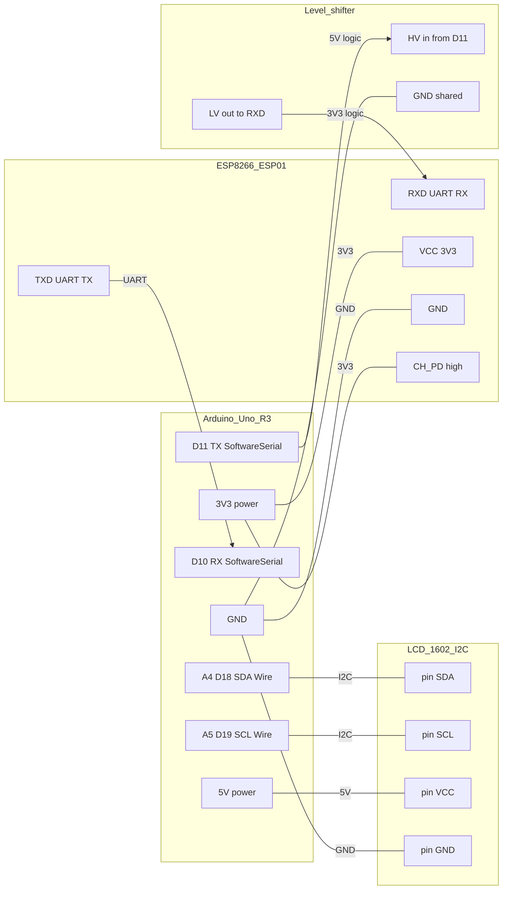

# arduino_weather

Turborepo monorepo: Next.js 15 (App Router) + Hono API at **`GET /api`**, Open-Meteo forecast for **Przemyśl** (Subcarpathian Voivodeship, Poland): **now + next 24 h** (9 points, 3-hour steps) and **today + next 7 days** (8 daily rows).

**Device client:** Firmware in **`firmware/arduino-weather-station`** polls **`GET /api/device`** (compact JSON for microcontrollers). The full forecast is still available at **`GET /api`** for the web UI or larger clients.

## Hardware wiring (Arduino Uno R3 + I2C LCD 1602 + ESP8266)

ESP8266 I/O is **3.3 V**; Uno GPIO is **5 V**. Use a **level shifter** (or resistive divider) on **Arduino TX → ESP8266 RXD** (do **not** connect Uno `D11` at 5 V directly to the module receive pin). Common ground (`GND`) is required.

Pin names below match typical **ESP-01** documentation (e.g. [SunFounder ESP8266 module pin table](https://docs.sunfounder.com/projects/3in1-kit-v2/en/latest/components/component_esp8266.html)): **TXD** / **RXD** for UART, **VCC** = 3.3 V supply, **CH_PD** must be **high** for normal operation (some docs label this enable pin similarly). **GPIO0** should be high for normal flash boot; **GPIO2** must be high at power-on per vendor guidance—many breakout/adapter boards already pull these; on a bare module, follow the datasheet for your PCB.

Some kits use an **ESP8266 adapter** with an **AMS1117** regulator so you can feed **5 V** from Arduino into the adapter and power the module at **3.3 V**. That only fixes **VCC**; you still need **level shifting** (or a divider) on **Uno TX (`D11`) → RXD**, because the UART line from the ATmega is 5 V logic.

Wiring overview (matches tables below):



| Signal | Arduino Uno R3 | Notes |
|--------|----------------|--------|
| I2C LCD `SDA` | **A4** | `Wire` default on Uno |
| I2C LCD `SCL` | **A5** | |
| I2C LCD `VCC` | **5 V** | Typical backpack is 5 V tolerant |
| I2C LCD `GND` | **GND** | |
| ESP8266 **TXD** (UART TX) | **D10** (Arduino `RX` for `SoftwareSerial`) | Cross: module TXD → Uno receive pin |
| ESP8266 **RXD** (UART RX) | **D11** (Arduino `TX` for `SoftwareSerial`) | Level-shift Uno TX (5 V) down to **RXD** (3.3 V) |
| ESP8266 **VCC** | **3.3 V** | Do **not** apply 5 V to **VCC** on the bare module |
| ESP8266 **GND** | **GND** | |
| ESP8266 **CH_PD** | **3.3 V** (often 10k pull-up on board) | Low = power off; high = run (per vendor table) |

On Uno, **A4** / **A5** are the I2C pins for `Wire` and can also be referenced as digital **D18** (SDA) / **D19** (SCL). Use the **A4 / A5 / D10 / D11 / 5 V / 3.3 V / GND** silkscreen on your board; clones may label headers differently.

### Pin-to-pin map

| Arduino Uno R3 | Peripheral pin | Notes |
|----------------|----------------|--------|
| **A4** (SDA, `Wire`) | I2C LCD backpack **SDA** | I2C |
| **A5** (SCL, `Wire`) | I2C LCD backpack **SCL** | I2C |
| **5 V** | I2C LCD backpack **VCC** | Typical backpack is 5 V tolerant |
| **GND** | I2C LCD backpack **GND** | Common ground |
| **D10** (`SoftwareSerial` RX) | ESP8266 **TXD** | Module TXD → Arduino RX |
| **D11** (`SoftwareSerial` TX) → level shifter **HV** | ESP8266 **RXD** | **LV** → **RXD**; never 5 V on **RXD** |
| **3.3 V** | ESP8266 **VCC** | 3.3 V only on bare ESP-01 |
| **GND** | ESP8266 **GND** | Common ground |
| **3.3 V** | ESP8266 **CH_PD** | Run mode = high (see SunFounder / module pinout) |

### Wiring diagram



**UART crossover:** **TXD** connects to Arduino **D10** (`SoftwareSerial` RX). **D11** (`SoftwareSerial` TX) connects to **RXD** only through a **3.3 V–compatible path** (level shifter or resistive divider), never a direct 5 V line to **RXD**.

The sketch uses **`SoftwareSerial` on D10/D11** so **`Serial` (USB)** stays free for debug at 115200 baud. I2C LCD address defaults to **`0x27`** (change in the sketch if your module uses `0x3F`).

See **`firmware/arduino-weather-station/README.md`** (PictoBlox, libraries, `secrets.h`) and **`firmware/arduino-weather-station/AT_TLS_CHECKLIST.md`** for HTTPS AT checks.

## Structure

- `apps/web` — Next.js UI, `app/api/[[...route]]` + `hono/vercel`, Edge `middleware` (rate limit)
- `packages/weather-core` — Open-Meteo client, Zod contract, **`toDeviceForecast`**
- `packages/api` — Hono app (`createApiApp`), shared with tests
- `firmware/arduino-weather-station` — Arduino sketch + AT TLS notes

## Scripts (repository root)

```bash
npm install
npm run dev      # turbo dev — Next on :3000
npm run build
npm test
npm run lint
```

## Environment (Vercel / local)

Rate limiting uses **Upstash Redis** (optional). If unset, requests are not application-limited (still behind Vercel edge protections).

- `UPSTASH_REDIS_REST_URL`
- `UPSTASH_REDIS_REST_TOKEN`

## Vercel

Deployments are driven by **Vercel’s Git integration**: pushes to the **production branch** (typically `main`) trigger a production build and deploy. You do **not** need GitHub Actions or `vercel deploy` in CI for that.

1. Create a project **from this GitHub repository** and authorize the Vercel GitHub app.
2. Under **Settings → Git**, set **Production Branch** to `main` (or your production branch).
3. Set **Root Directory** to `apps/web`.
4. For the monorepo, enable **Include source files outside of the Root Directory in the Build Step**, or rely on `apps/web/vercel.json` `installCommand` / `buildCommand` that run from the repo root.
5. Under **Settings → Environment Variables**, add the Upstash vars from the section above for **Production** (and **Preview** if you want rate limits on preview URLs too).

## API contract

### `GET /api`

Full JSON:

- `location` — name, region, country, latitude, longitude
- `now` — `time` (ISO-8601 with offset), `temperatureC`, optional `weatherCode` (instant at request time, interpolated from hourly forecast)
- `shortTerm` — **9** points: `offsetHours` **0, 3, …, 24**; each has `time`, `temperatureC`, optional `weatherCode` (linear interpolation between Open-Meteo hourly values)
- `days` — length **8** (today + next 7 days), daily max/min, codes, precipitation
- `meta` — `forecastDays: 8`, `shortTermStepHours: 3`, `shortTermHorizonHours: 24`, `timezone`, `source: "open-meteo"`, `fetchedAt`

### `GET /api/device`

Compact payload for **Arduino / ESP8266 AT** (short keys, integers, local clock fields). Built with `toDeviceForecast()` in `packages/weather-core/src/device.ts`:

- `v` — `1`
- `lh`, `lm` — local hour/minute for **`meta.timezone`** (e.g. `Europe/Warsaw`) at request time
- `t` — current temperature (°C, rounded)
- `w` — WMO weather code (integer)
- `st` — **9** entries: `h` (offset hours), `t` (°C rounded), `w` (code)

## Stack notes

- No Express — HTTP via **Hono** + Next route handlers.
- **Jest** + **Supertest** (`@repo/api`), unit tests (`@repo/weather-core`).
- TypeScript path aliases: `@repo/*` (see each package `tsconfig.json` / `apps/web`).
